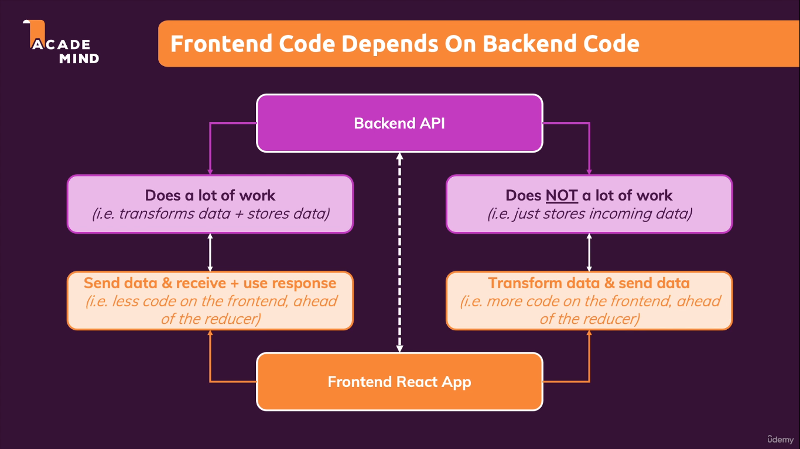

# ADVANCED REDUX

Reducers must be pure side-effect free, synchronous functions.
They take old state and action as inputs and then produces some output.

While working with redux, side-effects and async tasks can be executed inside:

(i) Inside components e.g. via useEffect() 
(ii) Inside the action creators 

Where should our code go?

For synchronous, side-effect free code.(e.g. data transformations) , we generally prefer reducers and avoid action creators or components

For async code or code wth side-effects, We can keep them in components using useEffect();

Other option is Action creators

Thunk: A function that delays an action until later

An action creator function that does not return the action itself but instead another function which eventually return the action. 
