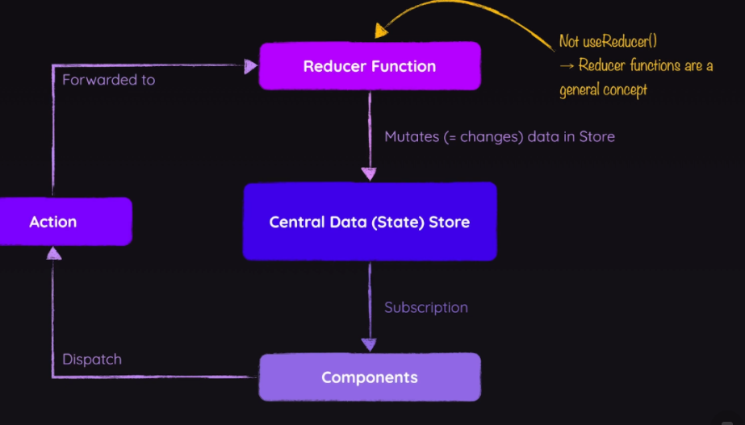
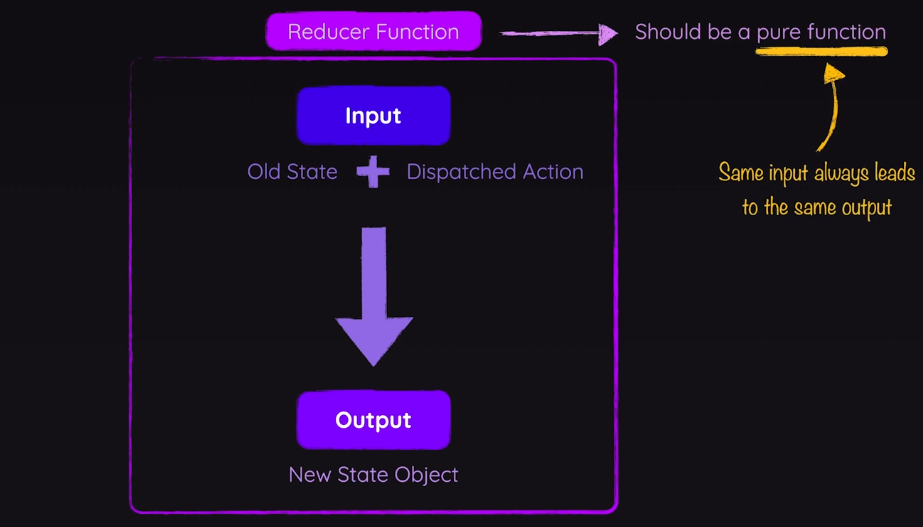

# Redux (An alternative to Context API)

A state management system for cross-component or app-wide state.

## State

Data which, when changed, should affect the UI.

### Local State

State belongs to a single component. It should be managed via `useState()`/`useReducer()` inside a component, e.g., listening to user input.

### Cross-component State

State affecting multiple components. Requires prop drilling, e.g., open/closed state of a modal.

### App-wide State

State affecting the entire app. Requires prop drilling, e.g., theme state, user auth status.

## Cons of React Context

1. **Complex Providers**: In more complex apps, using React context can lead to deeply nested or "fat" Context Provider components.
2. **Performance**: High frequency changes. React context is not optimized for high frequency state changes.

## How Redux Works

1. **Central Data (State) Store**: We have exactly one store for all our states of our application.
2. **Subscriptions**: Components set up subscriptions to our central store. Whenever data changes, the store notifies components and then components get the data and use it accordingly.
3. **Reducer Components**: Components never manipulate data directly. We set up reducer functions which are responsible for mutating the store data.
4. **Actions**: Components dispatch actions that reducers should perform. The actions are forwarded to the reducers and the reducer spits out a new state.



## Reducer Function

Reducer receives old state and the action to perform and returns a new state.



We should also provide default/fallback state to avoid error in reducer.

### Creating the store

```js
const counterReducer = (state = {counter: 0}, action) => {
    if(action.type==='increment'){
        return {
            counter: state.counter + 1
        }
    }
    if(action.type==='decrement'){
        return {
            counter: state.counter - 1
        }
    }
    return state;
}
const store = createStore(counterReducer);
const counterSubscriber =  () => {
    let latestState  = store.getState();
    console.log(latestState);
}

store.subscribe(counterSubscriber);
export default store;
```

### Providing the Store

```javascript
import React from 'react';
import ReactDOM from 'react-dom/client';
import { Provider } from 'react-redux';
import store from './store/index';
import App from './App';

const root = ReactDOM.createRoot(document.getElementById('root'));
root.render(
    <Provider store={store}>
        <App />
    </Provider>
);
```

## Using the Store in Components

Subscriptions to the store are managed automatically. 

To access state data, use the `useSelector` hook, and to dispatch actions, use the `useDispatch` hook.

```javascript
import React from 'react';
import { useSelector, useDispatch } from 'react-redux';
import classes from './Counter.module.css';

const Counter = () => {
    const dispatch = useDispatch();
    const counter = useSelector(state => state.counter);

    const incrementHandler = () => {
        dispatch({ type: 'increment' });
    };

    const decrementHandler = () => {
        dispatch({ type: 'decrement' });
    };

    return (
        <main className={classes.counter}>
            <h1>Redux Counter</h1>
            <div className={classes.value}>{counter}</div>
            <div>
                <button onClick={incrementHandler}>+</button>
                <button onClick={decrementHandler}>-</button>
            </div>
        </main>
    );
};

export default Counter;
```

### Attaching Payloads to Actions

```jsx
const Counter = () => {

  const dispatch = useDispatch();
  const counter = useSelector( state => state.counter);

  const increaseHandler = () => {
    dispatch({type: 'increase',amount: 5})//payload is 5
  }
  
  return (
    <main className={classes.counter}>
      <h1>Redux Counter</h1>
      <div className={classes.value}>{counter}</div>
      <div>
        <button onClick={increaseHandler}>+5</button>
      </div>
    </main>
  );
};
export default Counter;
```
```js
const counterReducer = (state = {counter: 0}, action) => {
    if(action.type ==='increase'){
        return {
            counter: state.counter + action.amount
        }
    }
    return state;
}
```

### Working with multiple state properties

```js
const initialState = {counter: 0, showCounter:true };
const counterReducer = (state = initialState, action) => {
    if(action.type ==='increase'){
        return {
            ...state,
            counter: state.counter + action.amount
        }
    }
    if(action.type ==='toggle'){
        return {
            ...state,
            showCounter: !state.showCounter
        }
    }
    return state;
}
```
```jsx
const Counter = () => {
  const dispatch = useDispatch();
  const counter = useSelector( state => state.counter);
  const show = useSelector(state => state.showCounter)
  const incrementHandler = () => {
    dispatch({type: 'increment'});
  }
  const increaseHandler = () => {
    dispatch({type: 'increase',amount: 5})
  }
  const decrementHandler = () => {
    dispatch({type:'decrement'})
  }
  const toggleCounterHandler = () => {
    dispatch({type:'toggle'});
  };

  return (
    <main className={classes.counter}>
      <h1>Redux Counter</h1>
      {show && <div className={classes.value}>{counter}</div>}
      <div>
        <button onClick={incrementHandler}>+</button>
        <button onClick={increaseHandler}>+5</button>
        <button onClick={decrementHandler}>-</button>
      </div>
      <button onClick={toggleCounterHandler}>Toggle Counter</button>
    </main>
  );
};
const Counter = () => {
  const dispatch = useDispatch();
  const counter = useSelector( state => state.counter);
  const show = useSelector(state => state.showCounter)

  const increaseHandler = () => {
    dispatch({type: 'increase',amount: 5})
  }
  const toggleCounterHandler = () => {
    dispatch({type:'toggle'});
  };
  return (
    <main className={classes.counter}>
      <h1>Redux Counter</h1>
      {show && <div className={classes.value}>{counter}</div>}
      <div>
        <button onClick={increaseHandler}>+5</button>
      </div>
      <button onClick={toggleCounterHandler}>Toggle Counter</button>
    </main>
  );
};
export default Counter;
```

## Redux Challenges

#### State Immutability 
Never mutate the state.Copy old state and then mutate, always return a new state. Copying large states could be resource intensive

#### Action Typos


## Redux Toolkit

Redux Toolkit uses internally packages that implement state immutability so we can write code that may look like mutable code but internally they are still immutable.

We can also export the actions which prevents typos;

```js
import {createSlice,configureStore} from "@reduxjs/toolkit";
const initialState = {counter: 0, showCounter:true };
const counterSlice = createSlice({
    name: 'counter',
    initialState,
    reducers: {
        increment(state){
            state.counter++;
        },
        decrement(state){
            state.counter--;
        },
        increase(state,action){
            state.counter += action.payload.amount
        },
        toggle(state){
            state.showCounter = !state.showCounter
        }
    }
});
const store = configureStore({
    reducer : {counter : counterSlice.reducer}
})
const counterSubscriber =  () => {
    let latestState  = store.getState();
    console.log(latestState);
}
store.subscribe(counterSubscriber);
export const counterActions = counterSlice.actions;
export default store;
```

```jsx
import { counterActions } from '../store';
const Counter = () => {  

  const dispatch = useDispatch();
  const counter = useSelector( state => state.counter.counter);
  const show = useSelector(state => state.counter.showCounter);
  
  const incrementHandler = () => {
    dispatch(counterActions.increment());
  }
  const increaseHandler = () => {
    dispatch(counterActions.increase({amount:5}));
  }
  const decrementHandler = () => {
    dispatch(counterActions.decrement());
  }
  const toggleCounterHandler = () => {
    dispatch(counterActions.toggle());
  };

  return (
    <main className={classes.counter}>
      <h1>Redux Counter</h1>
      {show && <div className={classes.value}>{counter}</div>}
      <div>
        <button onClick={incrementHandler}>+</button>
        <button onClick={increaseHandler}>+5</button>
        <button onClick={decrementHandler}>-</button>
      </div>
      <button onClick={toggleCounterHandler}>Toggle Counter</button>
    </main>
  );
};
export default Counter;
```