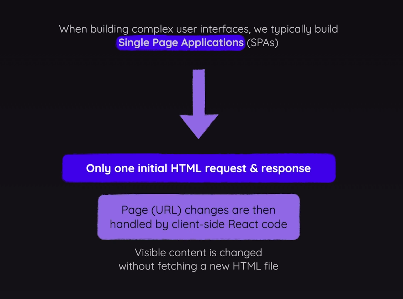

# Routing

Different URL paths load different content on screen.

Page change = New Request + Response



## Adding Routing:

1. Define the routes and components to load for those routes.
2. Activate and load the route definitions.
3. Provide the components and a means to navigate between the pages.

# Defining Routes

In `App.js`, we define the routes using `react-router-dom`:

```js
import { createBrowserRouter, RouterProvider, Route } from "react-router-dom";
// Define the routes and their corresponding components
const router = createBrowserRouter([
  { 
    path: '/',
    element: <Root />, // Root component acts as a layout wrapper
    children: [
      { path: '/', element: <Home /> }, // Home component for the root path
      { path: '/products', element: <Products /> } // Products component for the /products path
    ]
  }
]);
function App() {
  return <RouterProvider router={router} />;
}
```

The Root component serves as a layout wrapper for the application. It includes the main navigation and an outlet for rendering child routes.
```js
import { Outlet } from "react-router-dom";
import MainNavigation from "../components/MainNavigation";

function Root() {
  return (
    <>
      <h1>Root Layout</h1>
      <MainNavigation />
      <main>
        <Outlet />
      </main>
    </>
  );
}
```

The MainNavigation component provides links to navigate between different pages.
```js
function MainNavigation() {
  return (
    <header>
        <nav>
            <ul className={styles.list}>
                <li><Link to="/">Home</Link></li>
                <li><Link to="/products">Products</Link></li>
            </ul>
        </nav>
    </header>
  )
}
```

## Linking Pages

To navigate between pages, use the Link component from react-router-dom:
```js
import { Link } from "react-router-dom";
function Home() {
  return (
    <>
      <div>Home</div>
      <p>Go to <Link to="/products">the list of products</Link></p>
    </>
  );
}
```

## Adding error page

### Step 1: Define error component
Create an `Error` component that will be displayed when an error occurs. This component can include a message and any other relevant information.

```js
function Error() {
  return (
    <>
    <MainNavigation/>
    <main>
        <h1>An error occurred.</h1>
        <p>could not find this page!</p>
    </main>
    </>
  )
}
```
### Step 2: Add the Error Element to the Router

In your route definitions, specify the `errorElement` property for the root route. This property should be set to the `Error` component. The `errorElement` will be displayed whenever an error occurs during navigation or when a route is not found.

```js
const router = createBrowserRouter([
  { 
    path:'/',
    element: <Root/>,
    errorElement: <Error/>, 
    children: [
      {path: '/', element: <Home/>},
      {path:'/products', element: <Products/>}
    ]
  },//Layout Wrapper
]);
```

#### Note
In the `MainNavigation` component, `NavLink` is used to create navigation links. The `end` attribute is used to ensure that the link is only active when it exactly matches the current URL. This is useful for distinguishing between parent and child routes.


### Another way of navigating: useNavigate()

Purpose: Used to programmatically navigate to different routes.
Usage: Ideal for navigation based on events, such as form submissions, button clicks, or any other dynamic actions.
```js
function Error() {
    const navigate = useNavigate();
  return (
    <>
    <main>
        <h1>An error occurred.</h1>
        <p>could not find this page!</p>
        <button onClick={()=>navigate("/")}>Return home</button>
    </main>
    </>
  )
}
```


## Adding Dynamic Routing

Dynamic routing allows you to create routes that can handle dynamic segments in the URL. This is useful for displaying details of specific items, such as products, users, or posts.

```js
const router = createBrowserRouter([
  { 
    path:'/',
    element: <Root/>,
    errorElement: <Error/>, 
    children: [
      {path: '/', element: <Home/>},
      {path:'/products', element: <Products/>},
      {path:'/products/:productId', element:<ProductDetail/>}
    ]
  },//Layout Wrapper
]);
```
In the example above, the route `/products/:productId` is a dynamic route. The `:productId` part of the path is a placeholder for the actual product ID. When a user navigates to a URL like `/products/123`, the `ProductDetail` component will be rendered, and the `productId` parameter will be available in the component.

```js
function Products() {
  const PRODUCTS = [
    { id: "p1", title: "product 1" },
    { id: "p2", title: "product 2" },
    { id: "p3", title: "product 3" },
  ];
  return (
    <>
      <h1>Products</h1>
      <ul>  
        {
          PRODUCTS.map(product => (
            <li key={product.id}>
              <Link to={`/products/${product.id}`}>{product.title}</Link>
            </li>
          ))
        }
      </ul>
    </>
  );
}
```

```js
import { useParams } from 'react-router-dom'
function ProductDetail() {
    const params = useParams();
  return (
    <div>ProductDetail for {params.productId}</div>
  )
}
```
In the `ProductDetail` component, the `useParams` hook is used to access the `productId` parameter from the URL. This allows you to fetch and display the details of the specific product based on the ID.


## Relative and Absolute Paths

In react-router-dom, you can use relative and absolute paths for navigation. 

```js
function ProductDetail() {
  const params = useParams();
  return (
    <>
      <div>ProductDetail for {params.productId}</div>
      <p><Link to=".." relative="route">Back to Absolute Parent Route</Link></p>
      <p><Link to=".." relative="path">Back to Relative Parent Route</Link></p>
    </>
  );
}
```

### Index route

An index route in react-router-dom is a special type of route that renders when the parent route matches exactly. It is used to define the default child route for a parent route.

```js
const router = createBrowserRouter([
  { 
    path:'/',
    element: <Root/>,
    errorElement: <Error/>, 
    children: [
      // {path: '/', element: <Home/>},
      {index:true, element:<Home/>},
      {path:'products', element: <Products/>},
      {path:'products/:productId', element:<ProductDetail/>}
    ]
  },//Layout Wrapper
]);
```