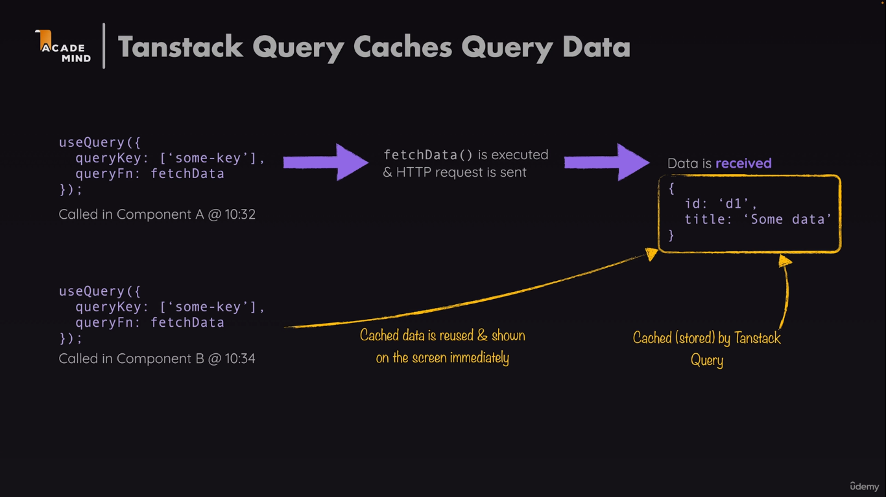

# Tanstack

A library that helps with sending HTTP requests and keeping your frontend UI in sync. It simplifies our code vastly rather than using `fetch` and `useEffect()` or building custom hooks. We can also cache as well as refetch data behind the scenes.

## Notes

- **Tanstack Query** does not send HTTP requests on its own. We have to write code that sends the actual HTTP request. Tanstack Query then manages the data, errors, caching, and much more!
- Every query requires a `queryKey` so that it can be cached and doesn't need to be fetched all the time. `queryKey` is an array. If a similar array is used with the same keys, then Tanstack is able to reuse existing data.
- We need to wrap components that need to use `useQuery` with `QueryClientProvider`.
- Caching is supported and we can add so by setting the `staleTime`,when to send next refetch request and `gcTime`, how long to keep the data in cache. By default, `staleTime` is 0 and `gcTime` is 5 minutes.
- **Meta Info**: Tanstack Query passes meta information to fetch functions, such as the `signal` property for aborting requests. This can be useful for handling request cancellations.
- **Enabled Option**: The `enabled` option in `useQuery` can be used to conditionally disable or enable the query. This is useful when you want to wait for certain conditions to be met before executing the query.



### Example Usage

Here is an example of how to use Tanstack Query in your project:

```jsx
export async function fetchEvents({ signal, searchTerm }) {
  console.log(searchTerm);
  let url = "http://localhost:3000/events";
  if (searchTerm) {
    url += "?search=" + searchTerm;
  }
  const response = await fetch(url, { signal: signal });

  if (!response.ok) {
    const error = new Error("An error occurred while fetching the events");
    error.code = response.status;
    error.info = await response.json();
    throw error;
  }
  const { events } = await response.json();
  return events;
}

import { useQuery } from "@tanstack/react-query";
export default function NewEventsSection() {
  const { data, isPending, isError, error } = useQuery({
    queryKey: ["events"],
    queryFn: fetchEvents,
    staleTime: 5000, // default value
    gctTIme: 1000, //
  });
  /*
rest of the code

  return (
xyz
      );
*/
}
```

### Setting Up QueryClientProvider

To use Tanstack Query, you need to set up the QueryClientProvider in your application:

```jsx
import { QueryClient, QueryClientProvider } from "@tanstack/react-query";
import { RouterProvider } from "react-router-dom";
const router = "some routes";
export default function App() {
  const queryClient = new QueryClient();
  return (
    <QueryClientProvider client={queryClient}>
      <RouterProvider router={router} />
    </QueryClientProvider>
  );
}
```

### Passing Parameters and metaInfo

```jsx
export default function FindEventSection() {
  const searchElement = useRef();
  const [searchTerm, setSearchTerm] = useState();

  const { data, isLoading, isError, error } = useQuery({
    queryKey: ["events", { search: searchTerm }],
    queryFn: ({ signal }) => fetchEvents({ signal, searchTerm }),
    enabled: searchTerm !== undefined,
  });
  /*
  rest of code
  return xyz
  */
}
```

### Sending POST Requests using useMutation()

To send POST requests, you can use the useMutation hook provided by Tanstack Query. Here is an example:

```jsx
export default function NewEvent() {
  const navigate = useNavigate();

  const { mutate, data, isPending, isError, error } = useMutation({
    mutationFn: createNewEvent,

    onSuccess: () => {
      queryClient.invalidateQueries({ queryKey: ["events"] });
    },
  });
  function handleSubmit(formData) {
    mutate({ event: formData });
  }
  /*
    rest of code
  */
}
```

### Optimistic Updating using `onMutate` and Rollback on `onError`

To implement optimistic updating, you can use the `onMutate` and `onError` options in `useMutation`. Here is an example:

```jsx
export default function EditEvent() {
  const params = useParams();
  const navigate = useNavigate();
  const { data, isPending, isError, error } = useQuery({
    queryKey: ["events", params.id],
    queryFn: ({ signal }) => fetchEvent({ signal, id: params.id }),
  });

  const { mutate } = useMutation({
    mutationFn: updateEvent,
    onMutate: async (data) => {
      const newEvent = data.event;
      await queryClient.cancelQueries({ queryKey: ["events", params.id] });
      const previousEvent = queryClient.getQueryData(["events", params.id]);
      queryClient.setQueryData(["events", params.id], newEvent);
      return { previousEvent }; //this will become context for accessing on Error
    },
    onError: (error, data, context) => {
      queryClient.setQueryData(["events", params.id], context.previousEvent);
    },
    onSettled: () => {
      queryClient.invalidateQueries("events", params.id);
    },
  });

  /*
    rest of code 
  */
}
```

- `onMutate` is used to optimistically update the cache before the mutation function is called. It cancels any outgoing queries for the event, gets the current event data, and sets the new event data in the cache.
- `onError` is used to rollback the optimistic update if the mutation fails. It restores the previous event data from the context.
- `onSettled` is used to invalidate the query after the mutation is either successful or fails, ensuring the cache is up-to-date.

